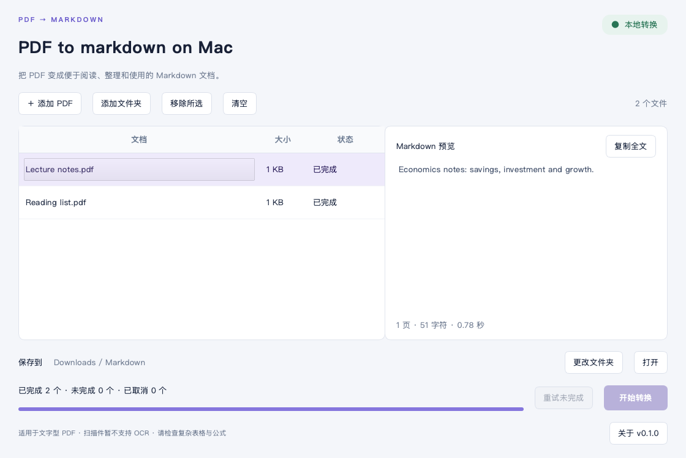

# PDF to markdown on Mac

一个面向 Mac 用户的本地 PDF 批量转换工具。选择多份 PDF，查看逐份转换状态，
再直接预览、复制或打开生成的 Markdown。



## 为什么做这个工具

把资料整理成 Markdown 时，逐条输入转换命令很繁琐。这个项目将常用操作放进
一个中文桌面界面：选择文件、批量转换、检查结果、重试失败文件。

转换引擎使用微软开源的 [MarkItDown]。项目新增了桌面界面、文件队列、
独立转换进程、取消与重试、同名保护和结果预览。

本项目采用 AI 辅助开发，由需求发起者主导功能选择和使用反馈。
项目独立维护，与 Microsoft 或 The Qt Company 无隶属或背书关系。

## 功能

- 多选 PDF，支持拖入文件和添加文件夹中的 PDF。
- 文件队列显示大小和等待、转换中、完成、失败等状态。
- 按文件显示批次进度；转换工作在子进程中进行。
- 取消任务，保留已经完成的结果，之后可重试未完成项。
- 某份文件失败后继续转换其他文件，并显示具体原因。
- 每份 PDF 保存为独立的 UTF-8 Markdown 文件。
- 遇到同名文件自动加编号，保留已有文件。
- 本地预览结果、复制全文和打开保存文件夹。
- 无需账号或模型 API Key；转换流程不调用在线大模型。

## 安装与使用

当前版本为 **0.1.0 预发布版**。本机验证平台为 Apple Silicon Mac。
发布的 Apple Silicon 应用包以 macOS 14 或更新版本为目标；
Intel 构建流程已提供，尚待对应设备验证。

### 使用应用包

如果发布页提供与你的芯片对应的 ZIP：

1. 解压 ZIP，将应用放入“应用程序”或其他本地文件夹。
1. 打开应用，点击“添加 PDF”，或把 PDF 拖入窗口。
1. 选择保存位置，点击“开始转换”。
1. 点击已完成的文件预览结果，或打开保存文件夹。

应用包含 Python 和所需组件，无需另行安装 Python。
当前构建使用临时签名，尚未通过 Apple Developer ID 签名和公证；
macOS 下载保护可能会阻止首次打开。
请按照 Apple 官方的[打开已知来源应用说明]处理。

### 从源码运行

需要 Python 3.12–3.14。以下命令在项目目录中运行：

```bash
python3 -m venv .venv
source .venv/bin/activate
python -m pip install -r requirements.txt
python app.py
```

## 支持范围

- 支持含有可提取文字的 PDF。
- 不支持扫描件 OCR；扫描页可能没有可提取文字。
- 对检测到的无文字图片页，会在结果中提示可能遗漏的页码。
- 不为照片、示意图或图表生成文字描述。
- 复杂表格、数学公式、双栏排版和阅读顺序可能需要手动检查。
- 加密 PDF 需要先解锁。
- 文件夹导入只读取当前层级，不递归扫描子文件夹。
- 大文档预览只显示前 200,000 字符，保存的文件仍包含完整提取结果。
- 安全发布文件使用硬链接；不支持该操作的目标磁盘会提示改用本地文件夹。

原始 PDF 应保留作为核对依据。转换成 Markdown 不等于摘要，
也不保证固定比例的模型 token 节省。

## 开发与测试

```bash
python -m pip install -r requirements-dev.txt
python -m pytest -q
```

测试使用代码生成的合成 PDF，不包含用户的私人文档。
覆盖真实转换、无文本 PDF、错误输入、重名保护、取消清理、
子进程通信、队列失败恢复、取消与重试、预览结果等行为。

测试工作流在 GitHub Actions 上运行；首次上传前，
这里只能确认本地测试结果，不能声称远程 CI 已通过。

## 构建 Mac 应用

在 macOS 上构建，需要 Apple Command Line Tools 或兼容的
`lipo`、`install_name_tool`，以及系统的 `codesign` 和 `iconutil`。

```bash
python -m pip install -r requirements-dev.txt
python scripts/build_macos.py
```

结果保存在 `dist/`，包含独立应用和 ZIP。
构建产物采用当前 Python 运行环境的处理器架构，不能把 ARM 包当作 Intel 包。
本地验证的完整依赖版本见 `requirements-lock-macos-arm64.txt`。

GitHub Actions 的手动构建工作流分别提供 ARM 和 Intel 构建任务，
生成下载附件，不自动创建公开 Release。

## 项目结构

```text
app.py                         应用和子进程入口
pdf_to_markdown/
  gui.py                       界面、队列和子进程管理
  engine.py                    PDF 转换与安全保存
  worker.py                    JSON 结果协议和错误映射
  config.py                    应用名称和标识
scripts/
  build_macos.py               独立应用构建
  collect_licenses.py          第三方许可收集
  make_icon.py                 原创图标生成
tests/                         合成文档与自动化测试
docs/                          界面截图、设计和版本说明
```

进一步了解：[设计说明](docs/architecture.md)、
[发布前检查](docs/release-checklist.md)、[版本记录](CHANGELOG.md)。

## 许可与致谢

本项目原创代码采用 [MIT License](LICENSE)。
MarkItDown、Qt/PySide6、Python 及其他组件保留各自的版权与许可。
构建时会将依赖版本和随包提供的许可文件收集到应用中。

详见 [第三方说明](THIRD_PARTY_NOTICES.md)。

[MarkItDown]: https://github.com/microsoft/markitdown
[打开已知来源应用说明]: https://support.apple.com/102445
